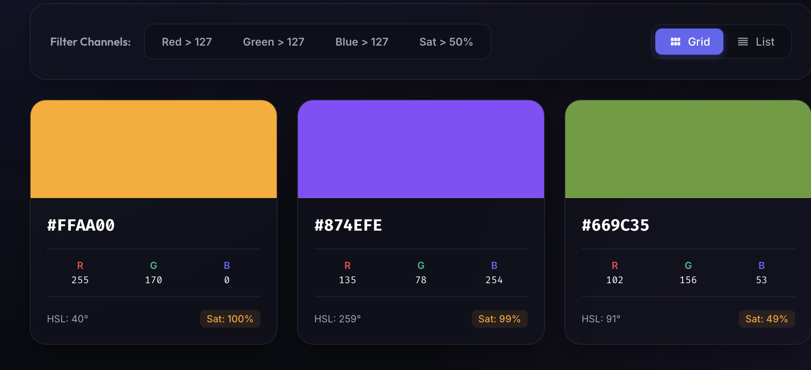
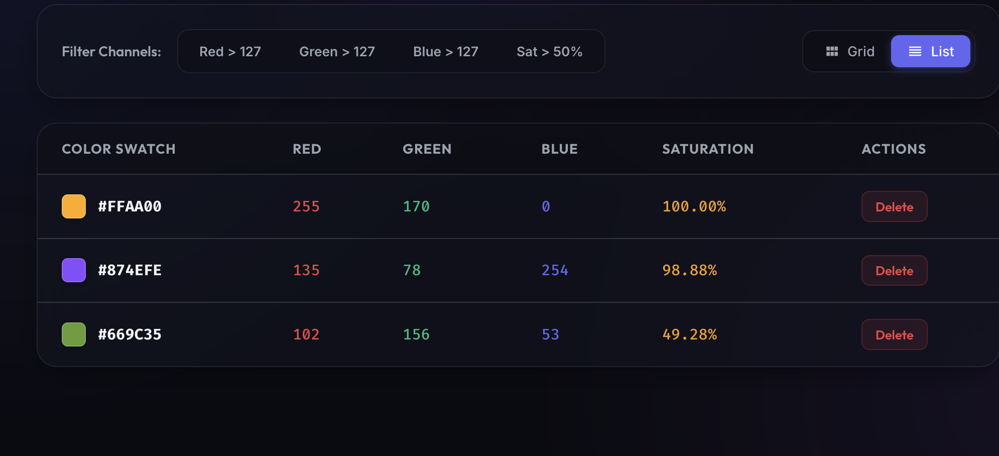

# Color Manager

Aplikacja webowa do zapisywania, opisywania i filtrowania kolorów — z trzema sposobami wprowadzania koloru, automatycznym wyliczaniem HSL i Saturation oraz trwałym zapisem w przeglądarce.

🔗 **Live demo:** [colorchecker-omega.vercel.app](https://colorchecker-omega.vercel.app)

## O projekcie

Color Manager to narzędzie dla każdego, kto pracuje z kolorami (projektanci, deweloperzy frontendu) i potrzebuje szybko zapisać, porównać i przefiltrować paletę barw bez zakładania konta czy instalowania dodatkowego oprogramowania. Wszystkie dane trzymane są lokalnie w przeglądarce (`localStorage`), więc aplikacja działa od razu, bez backendu i logowania.

## Funkcjonalności

- 🎨 **Trzy sposoby dodawania koloru:**
  - wpisanie kodu **HEX**,
  - wpisanie wartości **RGB**,
  - wybór za pomocą **pipety** (podgląd dowolnego koloru z ekranu).
- 📊 **Panel podglądu koloru** — obok HEX/RGB automatycznie wyliczane i wyświetlane są wartości **HSL** oraz **Saturation**.
- 💾 **Trwały zapis kolorów** w `localStorage` — paleta zostaje po odświeżeniu strony.
- 🔍 **Niezależne filtrowanie po kanałach R, G, B** — możliwość jednoczesnego sprawdzenia, które kolory mają wartość danego kanału większą niż 127 (dla R, G i B osobno, w dowolnej kombinacji).
- 🗂️ **Przełącznik widoku** — lista zapisanych kolorów w układzie **grid** lub **list**.
- 🗑️ **Usuwanie kolorów** z zapisanej palety.
- 📋 **Kopiowanie koloru** jednym kliknięciem.
- 🔔 **Powiadomienia popup** informujące użytkownika o wyniku każdej wykonanej akcji (dodanie, usunięcie, kopiowanie).

## Zrzuty ekranu

**Widok Grid** — filtrowanie po kanałach R/G/B oraz nasyceniu, panel każdego koloru z wartościami HEX, RGB, HSL i Saturation:



**Widok List** — te same dane w formie tabeli, z akcją usuwania koloru:



## Stack technologiczny

| Warstwa               | Technologia                        |
| --------------------- | ---------------------------------- |
| UI                    | React 18 + TypeScript              |
| Build / dev server    | Create React App (`react-scripts`) |
| Stylowanie            | Sass                               |
| Przechowywanie danych | `localStorage` (bez backendu)      |

## Uruchomienie lokalne

```bash
git clone https://github.com/Aszlaczek/ColorChecker.git
cd ColorChecker
npm install
npm start
```

Dostępne skrypty:

```bash
npm start   # tryb deweloperski (http://localhost:3000)
npm run build   # build produkcyjny
npm test    # testy
```

## Autor

Adrian Wzorek
